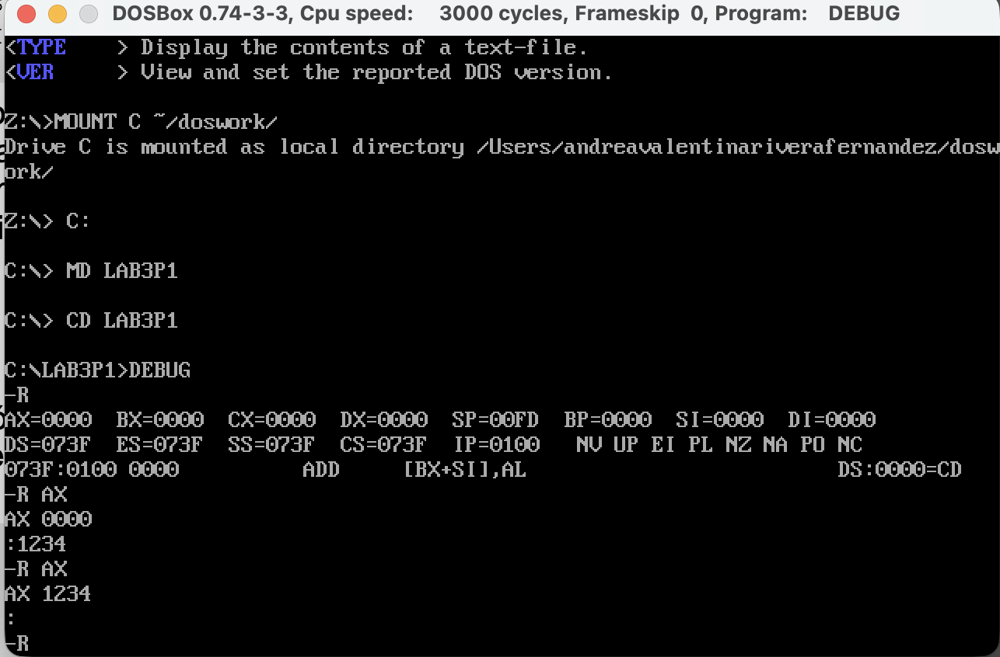
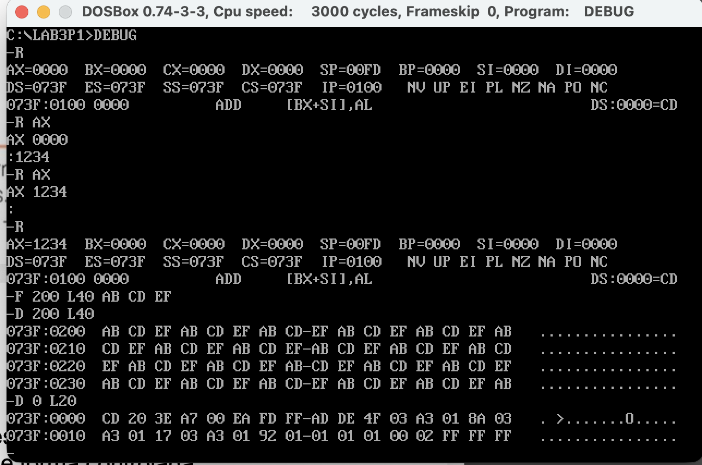
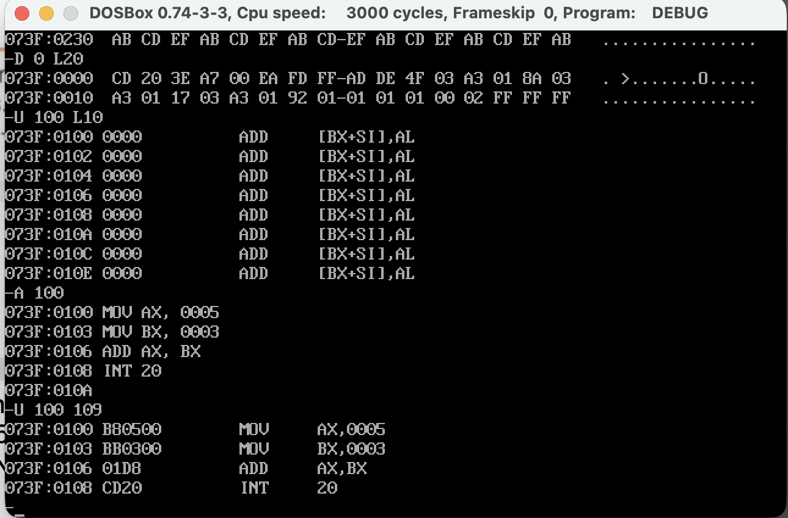

# Laboratorio: Exploración con DEBUG en DOSBox
## Unidad 3 — Manejo del DEBUG | Ingeniería de Sistemas 
### Asignatura — Arquitectura de Computadores
**Estudiante:** Andrea Valentina Rivera Fernandez  
**Codigo Estudiante:** 1152444  
**Repositorio:** rivera-post1-u3

---

## Descripción del laboratorio

El presente laboratorio tiene como objetivo configurar el entorno DOSBox en el equipo,
acceder al depurador DEBUG y utilizar los comandos R, D, F y U para
inspeccionar el estado inicial de los registros, rellenar y volcar bloques de memoria,
y desensamblar código en memoria. Cada etapa fue documentada con capturas de pantalla
almacenadas en la carpeta `/capturas/` del presente repositorio.

---

## Prerrequisitos utilizados

- DOSBox 0.74-3-3 instalado en macOS
- Carpeta de trabajo creada en: `~/doswork/`
- Subcarpeta del laboratorio: `LAB3P1`
- Cuenta de GitHub activa

---

## Descripción de los comandos utilizados

| Comando | Nombre completo | Descripción |
|---------|----------------|-------------|
| `R`     | Registers       | Muestra el estado completo de todos los registros del procesador (AX, BX, CX, DX, SP, BP, SI, DI, DS, ES, SS, CS, IP y banderas). Si se le pasa el nombre de un registro como argumento (`R AX`), permite modificar su valor. |
| `D`     | Dump            | Vuelca (muestra) el contenido de un bloque de memoria en formato hexadecimal y ASCII. Se indica la dirección de inicio y opcionalmente la longitud con `L`. Ejemplo: `D 200 L40` muestra 64 bytes desde el offset 0x200. |
| `F`     | Fill            | Rellena un rango de memoria con un patrón de bytes dado. El patrón se repite cíclicamente hasta cubrir todos los bytes indicados. Ejemplo: `F 200 L40 AB CD EF` rellena 64 bytes desde 0x200 con el patrón AB CD EF. |
| `U`     | Unassemble      | Desensambla los bytes almacenados en memoria y los traduce a instrucciones ensamblador legibles. Permite verificar qué instrucciones contiene una región de código. |
| `A`     | Assemble        | Permite escribir instrucciones en lenguaje ensamblador directamente en memoria. El DEBUG las traduce a bytes de código máquina en tiempo real. |

---

## Parte A — Configuración del entorno

Se montó la carpeta `~/doswork/` como unidad C: virtual en DOSBox mediante el comando
`MOUNT`. A continuación se creó la subcarpeta `LAB3P1` y se inició el depurador DEBUG
desde el prompt de DOS.

Comandos ejecutados:

```
Z:\> MOUNT C ~/doswork/
Drive C is mounted as local directory /Users/andreavalentinariverafernandez/doswork/
Z:\> C:
C:\> MD LAB3P1
C:\> CD LAB3P1
C:\LAB3P1> DEBUG
-
```

---

## Parte B — Inspección de registros con R

### Checkpoint 1 — CP1_registros.png

El comando `R` muestra el estado completo del procesador. Al iniciar DEBUG sin
argumentos, se observó el siguiente estado inicial:

```
AX=0000  BX=0000  CX=0000  DX=0000  SP=00FD  BP=0000  SI=0000  DI=0000
DS=073F  ES=073F  SS=073F  CS=073F  IP=0100   NV UP EI PL NZ NA PO NC
073F:0100 0000          ADD    [BX+SI],AL          DS:0000=CD
```

**Observaciones:**

- Los registros AX, BX, CX y DX se encuentran en cero al inicio, ya que no ha sido
  cargado ningún programa previo en memoria.
- El registro SP apunta a `0x00FD`, tope inicial de la pila asignada por el DOS.
- Los cuatro registros de segmento (DS, ES, SS, CS) apuntan al mismo valor `0x073F`,
  que es el párrafo de memoria donde el DOS cargó el PSP del proceso DEBUG.
- El registro IP se encuentra en `0x0100`, primera dirección ejecutable tras el PSP.
- Las banderas indican: NV (sin desbordamiento), UP (dirección ascendente), EI
  (interrupciones habilitadas), PL (resultado positivo), NZ (no cero), NA (sin
  acarreo auxiliar), PO (paridad impar), NC (sin acarreo).

Posteriormente se modificó el registro AX cargando el valor `0x1234` con el comando
`R AX`, demostrando que la modificación es selectiva y no altera el resto del estado.



---

## Parte C — Volcado de memoria con D y relleno con F

### Checkpoint 2 — CP2_volcado_memoria.png

**¿Qué representa cada columna de la salida del comando D?**

La salida del comando `D` se divide en tres columnas:

1. **Dirección de memoria** (izquierda): indica la ubicación de inicio de cada fila en formato
   `SEGMENTO:OFFSET` en hexadecimal. Ejemplo: `073F:0200` significa offset 0x0200 dentro del segmento 0x073F.
2. **Valores hexadecimales** (centro): muestra los 16 bytes por fila en hexadecimal, separados
   en dos grupos de 8 bytes por un guion central. Cada par de dígitos hexadecimales representa un byte de memoria.
3. **Representación ASCII** (derecha): muestra el carácter ASCII de cada byte. Si el byte está
   fuera del rango imprimible (0x20–0x7E), el DEBUG muestra un punto (`.`).

Se rellenaron 64 bytes (longitud L40 en hexadecimal) desde `DS:0200` con el patrón `AB CD EF` usando el comando
`F 200 L40 AB CD EF`. l DEBUG no emite mensaje de confirmación; el retorno al prompt – indica
ejecución sin errores. Al volcar la región con D 200 L40 se observó el
patrón repitiéndose cíclicamente en las cuatro filas:

```
073F:0200  AB CD EF AB CD EF AB CD-EF AB CD EF AB CD EF AB  ................
073F:0210  CD EF AB CD EF AB CD EF-AB CD EF AB CD EF AB CD  ................
073F:0220  EF AB CD EF AB CD EF AB-CD EF AB CD EF AB CD EF  ................
073F:0230  AB CD EF AB CD EF AB CD-EF AB CD EF AB CD EF AB  ................
```

La columna ASCII muestra únicamente puntos porque `0xAB`, `0xCD` y `0xEF` están
fuera del rango ASCII imprimible. Al explorar el PSP con `D 0 L20` se observaron
los bytes `CD 20` al inicio, correspondientes a la instrucción `INT 20` que el DOS
coloca como mecanismo de terminación controlada.



---

## Parte D — Desensamblado con U

### Checkpoint 3 — CP3_ensamblado_desensamblado.png

Al ejecutar `U 100 L10` antes de ensamblar, se observó que la región `073F:0100`
contenía bytes `0x00 0x00` interpretados por el DEBUG como instrucciones `ADD [BX+SI],AL`,
ilustrando que en modo real el procesador interpreta como instrucción cualquier
byte al que apunte CS:IP, sin distinción entre código y datos.

Se ensambló un programa de cuatro instrucciones en `CS:0100` con el comando `A 100`
y se verificó con `U 100 109`:

```
073F:0100 B80500        MOV    AX,0005
073F:0103 BB0300        MOV    BX,0003
073F:0106 01DB          ADD    AX,BX
073F:0108 CD20          INT    20
```

**Correspondencia instrucción–bytes:**

| Instrucción  | Bytes    | Descripción                                        |
|--------------|----------|----------------------------------------------------|
| MOV AX, 0005 | B8 05 00 | Opcode B8 + inmediato 0x0005 en little-endian      |
| MOV BX, 0003 | BB 03 00 | Opcode BB + inmediato 0x0003 en little-endian      |
| ADD AX, BX   | 01 DB    | Codificación ADD r/m16, r16 con ModRM=DB           |
| INT 20       | CD 20    | Opcode CD + número de interrupción 0x20            |

El programa completo ocupa 10 bytes en memoria. `MOV AX` y `MOV BX` usan 3 bytes cada una
(opcode + inmediato en little-endian), mientras que `ADD` e `INT 20` usan 2 bytes.



---

## Conclusiones
El laboratorio permitió comprender el funcionamiento interno del
procesador x86 en modo real mediante el uso del depurador DEBUG en DOSBox.
Se evidenció cómo los registros almacenan el estado del procesador y cómo pueden ser
inspeccionados y modificados de forma selectiva con el comando R. El volcado de
memoria reveló la estructura del PSP y la representación hexadecimal y ASCII de
los datos en memoria. El ensamblado y desensamblado de un programa simple demostró
la correspondencia directa entre instrucciones y bytes de código máquina, confirmando
que en modo real cualquier byte puede ser interpretado como instrucción dependiendo
únicamente de hacia dónde apunte el par CS:IP.
